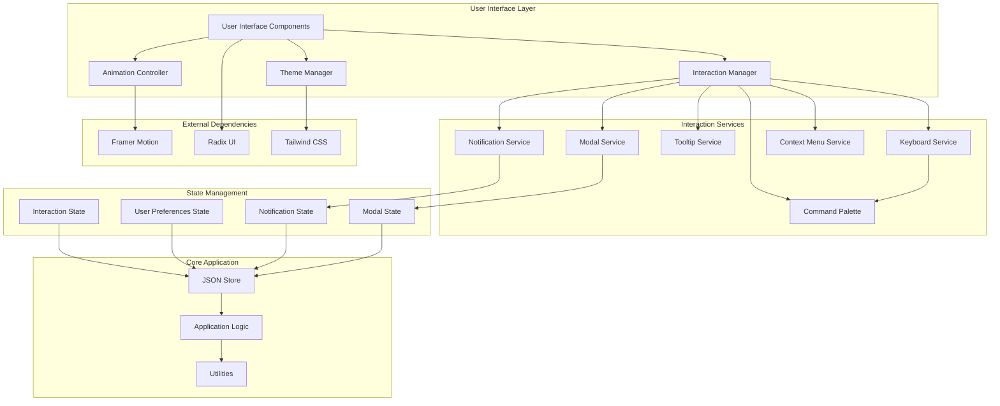

# Enhanced Page Interaction Design Document

## 1. Overview

### System Summary
The Enhanced Page Interaction Design system transforms the JSON Swiss application into a modern, intuitive, and responsive web application with polished user interactions. This design focuses on creating smooth animations, intelligent feedback systems, comprehensive accessibility features, and customizable user experiences that make JSON manipulation tasks more efficient and enjoyable.

### Core Purpose and Value Proposition
- **Smooth Interactions**: Implement fluid animations and transitions that provide visual continuity and polish
- **Intelligent Feedback**: Create comprehensive notification and loading systems that keep users informed
- **Enhanced Accessibility**: Ensure keyboard navigation, screen reader support, and customizable interface options
- **Mobile Optimization**: Provide touch-friendly interactions and responsive design patterns
- **Power User Features**: Implement advanced functionality like command palettes, context menus, and keyboard shortcuts

### Target Users and Use Cases
- **Primary Users**: Developers and data analysts requiring efficient JSON manipulation tools
- **Secondary Users**: Non-technical users needing occasional JSON processing with intuitive interfaces
- **Power Users**: Advanced users requiring keyboard shortcuts, customization, and advanced features
- **Mobile Users**: Users accessing the application on tablets and mobile devices

### Key Technologies and Architectural Approaches
- **Frontend Framework**: Next.js 15 with React 19 for modern component architecture
- **Animation Engine**: Framer Motion for smooth, performance-optimized animations
- **State Management**: Zustand with enhanced interaction state tracking
- **UI Components**: Radix UI primitives with custom interaction enhancements
- **Styling**: Tailwind CSS with CSS-in-JS for dynamic theming and animations
- **Accessibility**: ARIA compliance with focus management and screen reader optimization

## 2. Architecture

### High-Level Architecture



### Technology Stack Justification

#### Frontend Technologies
- **Next.js 15**: Modern React framework with App Router, server components, and optimized performance
- **React 19**: Latest React features including concurrent rendering and improved suspense
- **TypeScript**: Type safety and better developer experience for complex interaction logic
- **Framer Motion**: Industry-standard animation library with gesture support and layout animations
- **Radix UI**: Accessible component primitives with keyboard navigation and ARIA compliance built-in

#### Styling and Theming
- **Tailwind CSS**: Utility-first CSS framework for rapid development and consistent design
- **CSS Custom Properties**: Dynamic theming system for light/dark modes and user customization
- **CSS-in-JS**: Runtime styling for animation states and dynamic interactions

#### State Management
- **Zustand**: Lightweight state management with middleware support for persistence and dev tools
- **Immer**: Immutable state updates for complex interaction state management
- **React Query**: Server state management for any API interactions related to user preferences

## 3. Components and Interfaces

### Core Interaction Services

#### Animation Controller Service
```typescript
interface AnimationController {
  // Transition animations
  animateViewTransition(from: 'tree' | 'table', to: 'tree' | 'table'): Promise<void>;
  animateModalOpen(modalId: string, config?: AnimationConfig): Promise<void>;
  animateModalClose(modalId: string): Promise<void>;
  
  // Micro-interactions
  animateButtonHover(element: HTMLElement, state: 'enter' | 'leave'): void;
  animateTreeNodeExpansion(nodeId: string, expanded: boolean): Promise<void>;
  
  // Theme transitions
  animateThemeTransition(newTheme: 'light' | 'dark'): Promise<void>;
  
  // Performance and accessibility
  respectsReducedMotion(): boolean;
  setGlobalAnimationPreference(preference: 'full' | 'reduced' | 'none'): void;
}

interface AnimationConfig {
  duration?: number;
  easing?: string;
  delay?: number;
  onComplete?: () => void;
}
```

#### Notification Service
```typescript
interface NotificationService {
  // Toast notifications
  showToast(config: ToastConfig): string;
  dismissToast(toastId: string): void;
  dismissAllToasts(): void;
  
  // Progress notifications
  showProgress(config: ProgressConfig): string;
  updateProgress(progressId: string, progress: number): void;
  completeProgress(progressId: string, message?: string): void;
  
  // Error handling
  showError(error: AppError, recovery?: RecoveryAction[]): void;
  showSuccess(message: string, details?: string): void;
  
  // Queue management
  queueNotification(config: ToastConfig): void;
  setNotificationLimit(limit: number): void;
}

interface ToastConfig {
  message: string;
  type: 'success' | 'error' | 'warning' | 'info';
  duration?: number;
  actions?: ToastAction[];
  dismissible?: boolean;
}

interface ProgressConfig {
  title: string;
  description?: string;
  cancellable?: boolean;
  onCancel?: () => void;
}

interface ToastAction {
  label: string;
  handler: () => void;
  style?: 'primary' | 'secondary';
}
```

#### Modal Service
```typescript
interface ModalService {
  // Modal management
  openModal(config: ModalConfig): Promise<any>;
  closeModal(modalId: string, result?: any): void;
  closeAllModals(): void;
  
  // Focus management
  trapFocus(modalId: string): void;
  restoreFocus(modalId: string): void;
  
  // Modal stack
  getActiveModals(): string[];
  isModalOpen(modalId: string): boolean;
  
  // Confirmation dialogs
  confirm(message: string, options?: ConfirmConfig): Promise<boolean>;
  prompt(message: string, defaultValue?: string): Promise<string | null>;
}

interface ModalConfig {
  id: string;
  title: string;
  content: React.ComponentType<any>;
  size?: 'small' | 'medium' | 'large' | 'fullscreen';
  closable?: boolean;
  backdrop?: 'blur' | 'dark' | 'none';
  onClose?: (result?: any) => void;
  responsive?: boolean;
}
```

#### Keyboard Service
```typescript
interface KeyboardService {
  // Shortcut registration
  registerShortcut(config: ShortcutConfig): void;
  unregisterShortcut(id: string): void;
  
  // Command palette
  openCommandPalette(): void;
  closeCommandPalette(): void;
  registerCommand(command: Command): void;
  
  // Navigation
  focusNext(): void;
  focusPrevious(): void;
  focusFirst(): void;
  focusLast(): void;
  
  // Context management
  pushContext(context: KeyboardContext): void;
  popContext(): void;
  getCurrentContext(): KeyboardContext;
}

interface ShortcutConfig {
  id: string;
  keys: string[];
  description: string;
  handler: (event: KeyboardEvent) => void;
  context?: string[];
  global?: boolean;
}

interface Command {
  id: string;
  title: string;
  description?: string;
  keywords?: string[];
  handler: () => void;
  icon?: React.ComponentType;
  category?: string;
}
```

#### Context Menu Service
```typescript
interface ContextMenuService {
  // Menu management
  showContextMenu(config: ContextMenuConfig): void;
  hideContextMenu(): void;
  
  // Menu registration
  registerContextProvider(selector: string, provider: ContextProvider): void;
  unregisterContextProvider(selector: string): void;
  
  // Touch alternatives
  showActionSheet(config: ActionSheetConfig): void;
}

interface ContextMenuConfig {
  x: number;
  y: number;
  items: ContextMenuItem[];
  target?: HTMLElement;
}

interface ContextMenuItem {
  id: string;
  label: string;
  icon?: React.ComponentType;
  handler: () => void;
  disabled?: boolean;
  separator?: boolean;
  submenu?: ContextMenuItem[];
}

interface ContextProvider {
  getMenuItems(target: HTMLElement, context: any): ContextMenuItem[];
}
```

#### Tooltip Service
```typescript
interface TooltipService {
  // Tooltip management
  showTooltip(element: HTMLElement, config: TooltipConfig): void;
  hideTooltip(element: HTMLElement): void;
  hideAllTooltips(): void;
  
  // Rich tooltips
  showRichTooltip(element: HTMLElement, content: React.ComponentType): void;
  
  // Mobile alternatives
  showInfoPanel(config: InfoPanelConfig): void;
  
  // Positioning
  calculateOptimalPosition(element: HTMLElement, tooltip: HTMLElement): Position;
}

interface TooltipConfig {
  content: string | React.ComponentType;
  placement?: 'top' | 'bottom' | 'left' | 'right' | 'auto';
  delay?: number;
  interactive?: boolean;
  rich?: boolean;
}
```

### Enhanced UI Components

#### Interactive Button Component
```typescript
interface InteractiveButtonProps {
  variant: 'primary' | 'secondary' | 'ghost' | 'danger';
  size: 'small' | 'medium' | 'large';
  loading?: boolean;
  disabled?: boolean;
  tooltip?: string;
  shortcut?: string;
  onClick: () => void;
  children: React.ReactNode;
  animate?: boolean;
  hapticFeedback?: boolean;
}
```

#### Enhanced Drag Drop Zone
```typescript
interface DragDropZoneProps {
  onDrop: (files: File[]) => void;
  accept?: string[];
  multiple?: boolean;
  disabled?: boolean;
  children: React.ReactNode;
  
  // Visual feedback
  highlightColor?: string;
  invalidColor?: string;
  
  // Animation config
  animateOnHover?: boolean;
  animateOnDrop?: boolean;
  
  // Progress
  showProgress?: boolean;
  onProgress?: (progress: number) => void;
}
```

#### Responsive Layout Container
```typescript
interface ResponsiveLayoutProps {
  breakpoints: {
    mobile: number;
    tablet: number;
    desktop: number;
  };
  
  layouts: {
    mobile: LayoutConfig;
    tablet: LayoutConfig;
    desktop: LayoutConfig;
  };
  
  transitionDuration?: number;
  children: React.ReactNode;
}

interface LayoutConfig {
  sidebar: 'hidden' | 'overlay' | 'push' | 'inline';
  orientation: 'horizontal' | 'vertical';
  panelSizes: number[];
}
```

## 4. Data Models

### State Management Interfaces

#### Interaction State
```typescript
interface InteractionState {
  // Animation state
  animations: {
    enabled: boolean;
    reducedMotion: boolean;
    currentAnimations: Map<string, AnimationInstance>;
  };
  
  // Focus management
  focus: {
    currentElement?: HTMLElement;
    focusStack: HTMLElement[];
    trapStack: string[];
  };
  
  // Modal state
  modals: {
    openModals: ModalInstance[];
    modalStack: string[];
    backdrop: boolean;
  };
  
  // Notification state
  notifications: {
    toasts: ToastInstance[];
    progressIndicators: ProgressInstance[];
    queue: ToastConfig[];
  };
  
  // Context menu state
  contextMenu: {
    visible: boolean;
    position: { x: number; y: number };
    items: ContextMenuItem[];
    target?: HTMLElement;
  };
  
  // Command palette state
  commandPalette: {
    open: boolean;
    query: string;
    filteredCommands: Command[];
    selectedIndex: number;
  };
  
  // Touch and gesture state
  gestures: {
    activeGestures: Map<string, GestureState>;
    swipeThreshold: number;
    touchTargetSize: number;
  };
}
```

#### User Preferences State
```typescript
interface UserPreferencesState {
  // Theme and appearance
  theme: {
    mode: 'light' | 'dark' | 'system';
    colorScheme: string;
    customColors?: ColorScheme;
    density: 'compact' | 'normal' | 'comfortable';
  };
  
  // Animation preferences
  animations: {
    enabled: boolean;
    reducedMotion: boolean;
    transitionSpeed: 'slow' | 'normal' | 'fast';
  };
  
  // Accessibility preferences
  accessibility: {
    highContrast: boolean;
    largeText: boolean;
    screenReaderOptimized: boolean;
    keyboardNavigationOnly: boolean;
  };
  
  // Interface customization
  interface: {
    sidebarWidth: number;
    panelLayout: LayoutConfig;
    hiddenFeatures: string[];
    pinnedTools: string[];
  };
  
  // Notification preferences
  notifications: {
    level: 'all' | 'important' | 'minimal' | 'none';
    duration: number;
    sound: boolean;
    position: 'top-right' | 'top-left' | 'bottom-right' | 'bottom-left';
  };
  
  // Keyboard shortcuts
  shortcuts: {
    customShortcuts: Record<string, string[]>;
    disabledShortcuts: string[];
    showHints: boolean;
  };
  
  // Workspace configurations
  workspaces: {
    current: string;
    saved: Record<string, WorkspaceConfig>;
  };
}

interface WorkspaceConfig {
  id: string;
  name: string;
  description?: string;
  layout: LayoutConfig;
  theme: string;
  pinnedTools: string[];
  customizations: Record<string, any>;
  createdAt: Date;
  updatedAt: Date;
}
```

#### Toast and Notification Models
```typescript
interface ToastInstance {
  id: string;
  config: ToastConfig;
  createdAt: Date;
  expiresAt?: Date;
  dismissed: boolean;
  animationState: 'entering' | 'visible' | 'exiting';
}

interface ProgressInstance {
  id: string;
  config: ProgressConfig;
  progress: number;
  status: 'active' | 'completed' | 'cancelled' | 'error';
  createdAt: Date;
  completedAt?: Date;
}

interface ModalInstance {
  id: string;
  config: ModalConfig;
  result?: any;
  animationState: 'opening' | 'open' | 'closing' | 'closed';
  previousFocus?: HTMLElement;
}
```

#### Animation and Gesture Models
```typescript
interface AnimationInstance {
  id: string;
  element: HTMLElement;
  config: AnimationConfig;
  status: 'pending' | 'active' | 'completed' | 'cancelled';
  startTime: number;
  controls?: any; // Framer Motion controls
}

interface GestureState {
  type: 'swipe' | 'pinch' | 'longpress' | 'drag';
  element: HTMLElement;
  startPosition: { x: number; y: number };
  currentPosition: { x: number; y: number };
  velocity: { x: number; y: number };
  scale?: number;
  rotation?: number;
  active: boolean;
}
```

### Local Storage Schema
```typescript
interface StoredPreferences {
  version: string;
  preferences: UserPreferencesState;
  workspaces: Record<string, WorkspaceConfig>;
  lastUpdated: string;
}
```

## 5. Error Handling

### Error Classification and Response Strategy

#### Error Types and Display Patterns
```typescript
interface AppError {
  id: string;
  type: 'validation' | 'network' | 'processing' | 'system' | 'user';
  severity: 'low' | 'medium' | 'high' | 'critical';
  message: string;
  description?: string;
  context?: any;
  timestamp: Date;
  recoverable: boolean;
  recoveryActions?: RecoveryAction[];
}

interface RecoveryAction {
  id: string;
  label: string;
  description?: string;
  handler: () => Promise<void>;
  primary?: boolean;
}

// Error display strategies
interface ErrorDisplayStrategy {
  toast: (error: AppError) => ToastConfig;
  modal: (error: AppError) => ModalConfig;
  inline: (error: AppError) => InlineErrorConfig;
  overlay: (error: AppError) => OverlayErrorConfig;
}
```

#### Error Handling Service
```typescript
interface ErrorHandlingService {
  // Error reporting
  reportError(error: AppError): void;
  reportUserFeedback(errorId: string, feedback: string): void;
  
  // Error recovery
  suggestRecovery(error: AppError): RecoveryAction[];
  executeRecovery(errorId: string, actionId: string): Promise<void>;
  
  // Error display
  displayError(error: AppError, strategy?: 'toast' | 'modal' | 'inline'): void;
  dismissError(errorId: string): void;
  
  // Error prevention
  validateBeforeAction(action: string, context: any): ValidationResult;
  confirmDestructiveAction(action: string): Promise<boolean>;
}
```

### Specific Error Scenarios

#### JSON Processing Errors
```typescript
interface JSONProcessingError extends AppError {
  type: 'processing';
  subType: 'parsing' | 'validation' | 'transformation';
  position?: { line: number; column: number };
  suggestion?: string;
  exampleFix?: string;
}
```

#### Animation and Performance Errors
```typescript
interface AnimationError extends AppError {
  type: 'system';
  subType: 'animation';
  element?: HTMLElement;
  animationId?: string;
  fallbackMode: 'reduced' | 'disabled';
}
```

## 6. Testing Strategy

### Unit Testing Approach

#### Component Testing Framework
```typescript
// Using Jest + React Testing Library + Framer Motion testing utilities

describe('InteractiveButton', () => {
  it('should animate on hover when animations are enabled', async () => {
    const mockAnimationController = createMockAnimationController();
    render(
      <InteractiveButton animate={true} onClick={() => {}}>
        Test Button
      </InteractiveButton>
    );
    
    const button = screen.getByRole('button');
    fireEvent.mouseEnter(button);
    
    await waitFor(() => {
      expect(mockAnimationController.animateButtonHover).toHaveBeenCalledWith(
        button,
        'enter'
      );
    });
  });
  
  it('should respect reduced motion preferences', () => {
    const mockAnimationController = createMockAnimationController({
      respectsReducedMotion: () => true
    });
    
    // Test implementation
  });
});
```

#### Service Testing
```typescript
describe('NotificationService', () => {
  let notificationService: NotificationService;
  let mockStore: MockStore;
  
  beforeEach(() => {
    mockStore = createMockStore();
    notificationService = new NotificationService(mockStore);
  });
  
  it('should queue notifications when limit is exceeded', () => {
    // Set limit to 3
    notificationService.setNotificationLimit(3);
    
    // Add 5 notifications
    for (let i = 0; i < 5; i++) {
      notificationService.showToast({
        message: `Test ${i}`,
        type: 'info'
      });
    }
    
    // Should have 3 visible and 2 queued
    expect(mockStore.getState().notifications.toasts).toHaveLength(3);
    expect(mockStore.getState().notifications.queue).toHaveLength(2);
  });
});
```

### Integration Testing

#### Interaction Flow Testing
```typescript
describe('Modal Interaction Flow', () => {
  it('should handle complete modal lifecycle with keyboard navigation', async () => {
    render(<TestApp />);
    
    // Open modal via keyboard shortcut
    fireEvent.keyDown(document, { key: 'k', ctrlKey: true });
    
    // Verify modal opens and focus is trapped
    const modal = await screen.findByRole('dialog');
    expect(modal).toBeInTheDocument();
    expect(document.activeElement).toBeWithin(modal);
    
    // Test tab navigation within modal
    fireEvent.keyDown(document, { key: 'Tab' });
    // Verify focus moves correctly
    
    // Test escape key closing
    fireEvent.keyDown(document, { key: 'Escape' });
    await waitForElementToBeRemoved(modal);
    
    // Verify focus is restored
    expect(document.activeElement).toBe(previousFocus);
  });
});
```

#### Animation Integration Testing
```typescript
describe('Animation Integration', () => {
  it('should coordinate multiple animations without conflicts', async () => {
    const { container } = render(<AnimatedTransition />);
    
    // Trigger view mode change
    const tableButton = screen.getByText('Table View');
    fireEvent.click(tableButton);
    
    // Verify animation sequence
    await waitFor(() => {
      expect(container.querySelector('.fade-out')).toBeInTheDocument();
    });
    
    await waitFor(() => {
      expect(container.querySelector('.fade-in')).toBeInTheDocument();
    }, { timeout: 1000 });
  });
});
```

### End-to-End Testing

#### Playwright E2E Tests
```typescript
// tests/interactions.spec.ts
import { test, expect } from '@playwright/test';

test.describe('Enhanced Interactions', () => {
  test('complete user workflow with all interactions', async ({ page }) => {
    await page.goto('/');
    
    // Test drag and drop
    await page.setInputFiles('input[type="file"]', 'test-data.json');
    await expect(page.locator('.success-toast')).toBeVisible();
    
    // Test keyboard shortcuts
    await page.keyboard.press('Control+k');
    await expect(page.locator('[role="dialog"]')).toBeVisible();
    
    // Test context menu
    await page.click('.json-tree-node', { button: 'right' });
    await expect(page.locator('.context-menu')).toBeVisible();
    
    // Test mobile interactions (if applicable)
    await page.setViewportSize({ width: 390, height: 844 });
    await page.tap('.mobile-menu-trigger');
    await expect(page.locator('.mobile-menu')).toBeVisible();
  });
  
  test('accessibility compliance', async ({ page }) => {
    await page.goto('/');
    
    // Test keyboard navigation
    await page.keyboard.press('Tab');
    await expect(page.locator(':focus')).toBeVisible();
    
    // Test screen reader labels
    const button = page.locator('button').first();
    await expect(button).toHaveAttribute('aria-label');
    
    // Test color contrast
    // Use axe-playwright for comprehensive a11y testing
  });
});
```

### Performance Testing

#### Animation Performance Tests
```typescript
describe('Animation Performance', () => {
  it('should maintain 60fps during complex animations', async () => {
    const performanceObserver = new PerformanceObserver((list) => {
      const entries = list.getEntries();
      entries.forEach((entry) => {
        if (entry.entryType === 'measure') {
          expect(entry.duration).toBeLessThan(16.67); // 60fps threshold
        }
      });
    });
    
    performanceObserver.observe({ entryTypes: ['measure'] });
    
    // Trigger complex animation
    const { container } = render(<ComplexAnimatedComponent />);
    fireEvent.click(container.querySelector('.trigger-animation'));
    
    await new Promise(resolve => setTimeout(resolve, 1000));
  });
});
```

## 7. Security Considerations

### Input Validation and Sanitization

#### Drag and Drop Security
```typescript
interface SecureDragDropHandler {
  validateFileType(file: File): boolean;
  sanitizeFileName(fileName: string): string;
  checkFileSize(file: File, maxSize: number): boolean;
  scanForMaliciousContent(content: string): SecurityScanResult;
}

interface SecurityScanResult {
  safe: boolean;
  threats: string[];
  sanitizedContent?: string;
}
```

#### User Input Security
```typescript
interface InputSanitizer {
  sanitizeTooltipContent(content: string): string;
  validateShortcutKeys(keys: string[]): boolean;
  sanitizeUserPreferences(prefs: UserPreferencesState): UserPreferencesState;
  validateWorkspaceConfig(config: WorkspaceConfig): ValidationResult;
}
```

### XSS Prevention in Dynamic Content

#### Safe Content Rendering
```typescript
interface SafeContentRenderer {
  renderSafeHTML(content: string): string;
  sanitizeTooltipContent(content: string | React.ComponentType): React.ComponentType;
  validateNotificationContent(config: ToastConfig): ToastConfig;
}
```

### Local Storage Security

#### Preference Storage Security
```typescript
interface SecurePreferenceStorage {
  encryptSensitiveData(data: any): string;
  decryptSensitiveData(encrypted: string): any;
  validateStoredData(data: any): boolean;
  migrateData(oldVersion: string, newVersion: string): void;
}
```

### Content Security Policy

#### CSP Headers for Enhanced Security
```typescript
// next.config.js security headers
const securityHeaders = [
  {
    key: 'Content-Security-Policy',
    value: `
      default-src 'self';
      script-src 'self' 'unsafe-eval' 'unsafe-inline';
      style-src 'self' 'unsafe-inline';
      img-src 'self' data: blob:;
      font-src 'self';
      object-src 'none';
      base-uri 'self';
      form-action 'self';
      frame-ancestors 'none';
      upgrade-insecure-requests;
    `.replace(/\s{2,}/g, ' ').trim()
  }
];
```

## 8. Implementation Roadmap

### Phase 1: Core Animation System (Week 1-2)
- Implement AnimationController service
- Add Framer Motion integration
- Create basic transition animations
- Implement reduced motion support

### Phase 2: Notification and Feedback Systems (Week 3-4)
- Build NotificationService with toast system
- Implement progress indicators
- Create error handling with recovery actions
- Add haptic feedback for mobile

### Phase 3: Enhanced Navigation (Week 5-6)
- Implement KeyboardService with shortcuts
- Build command palette functionality
- Add context menu system
- Create focus management utilities

### Phase 4: Mobile and Touch Optimization (Week 7-8)
- Implement touch gesture recognition
- Create responsive layout system
- Add mobile-specific interactions
- Optimize for various screen sizes

### Phase 5: Customization and Accessibility (Week 9-10)
- Build user preference system
- Implement accessibility features
- Create workspace management
- Add comprehensive keyboard navigation

### Phase 6: Testing and Polish (Week 11-12)
- Write comprehensive test suites
- Performance optimization
- Cross-browser compatibility testing
- Final accessibility audit

This design provides a comprehensive blueprint for implementing enhanced page interactions that address all requirements while maintaining high performance, security, and accessibility standards.